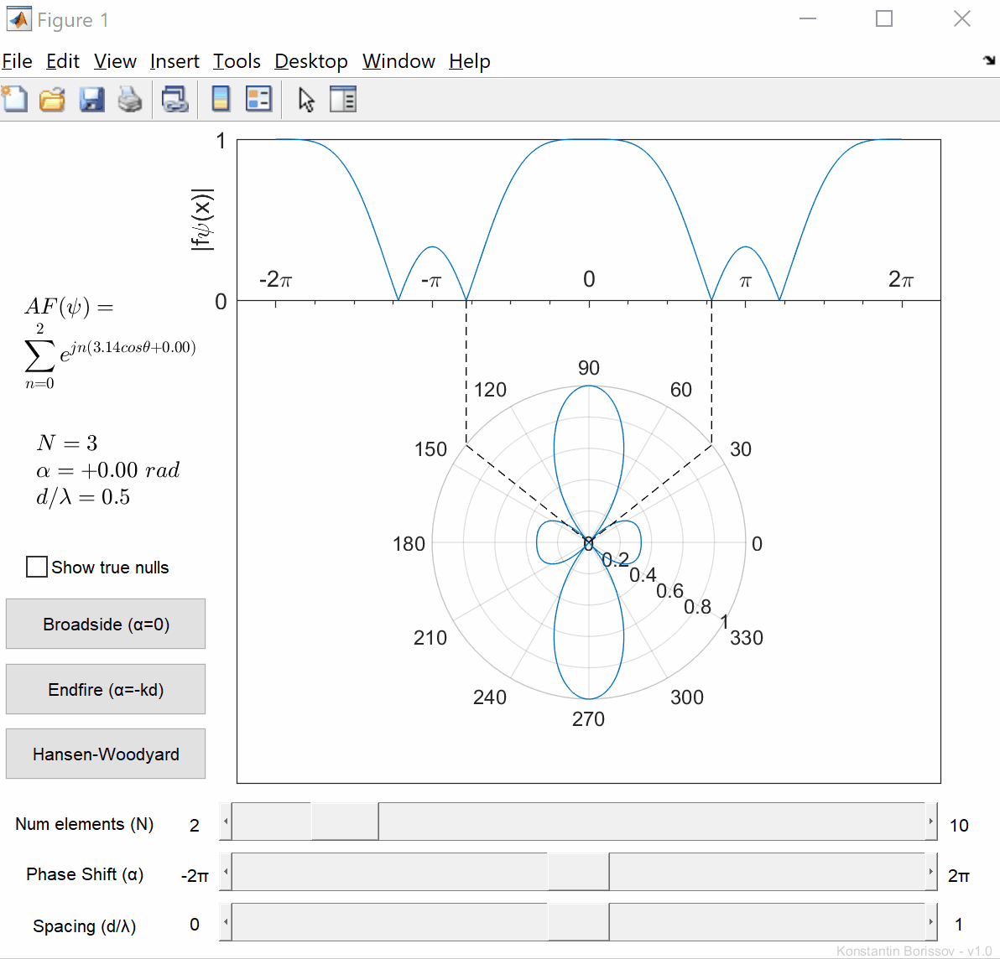
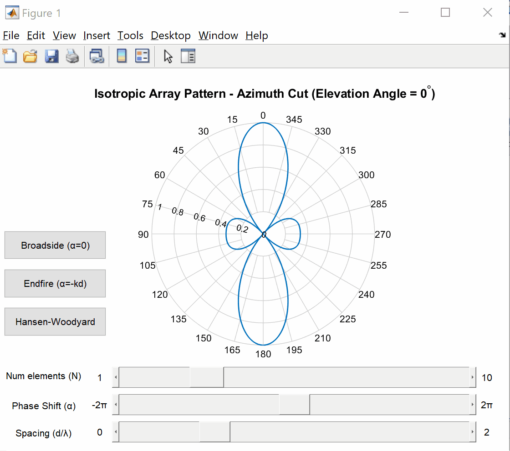
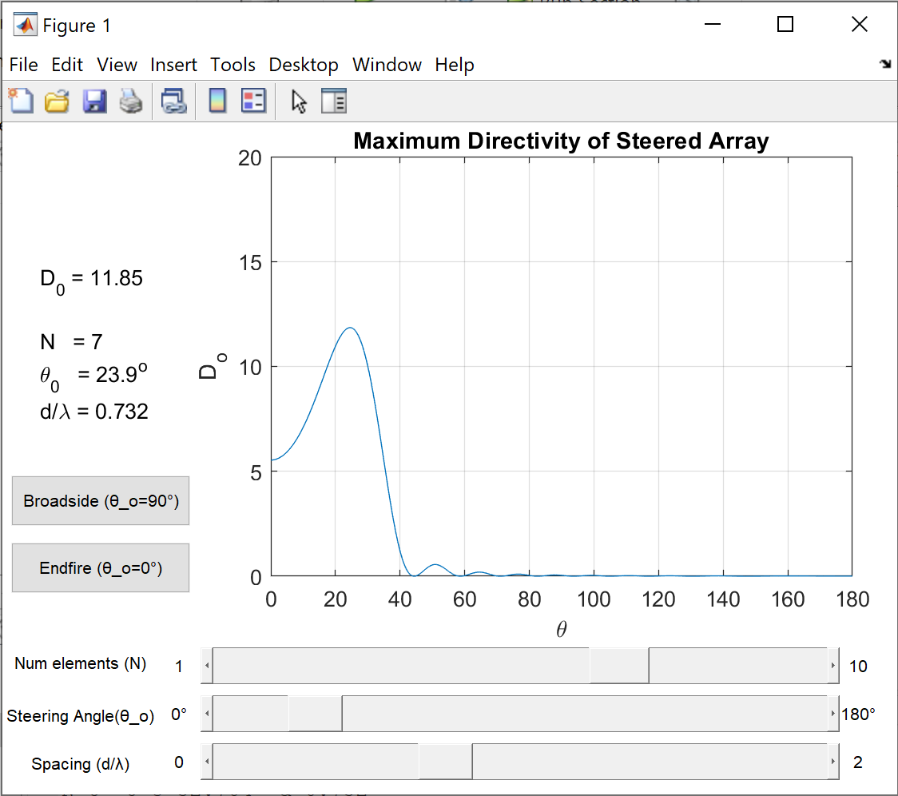

# Interactive-Antenna-Array-Plots
Interactive MATLAB tools for visualizing the polar pattern of an isotropic array.

## Interactive Polar Procedure
Tool for visualizing the systematic procedure used for plotting the polar pattern of an array factor. 
[interactive_polar_procedure.m](/interactive_polar_procedure.m)

## Array Pattern Plotter
Tool for plotting 2-D patterns of an isotropic array.  
[interactive_array.m](/interactive_array.m)

## Array Directivity 
Tool graphing the directivity.  
[interactive_directivity.m](/interactive_directivity.m)

